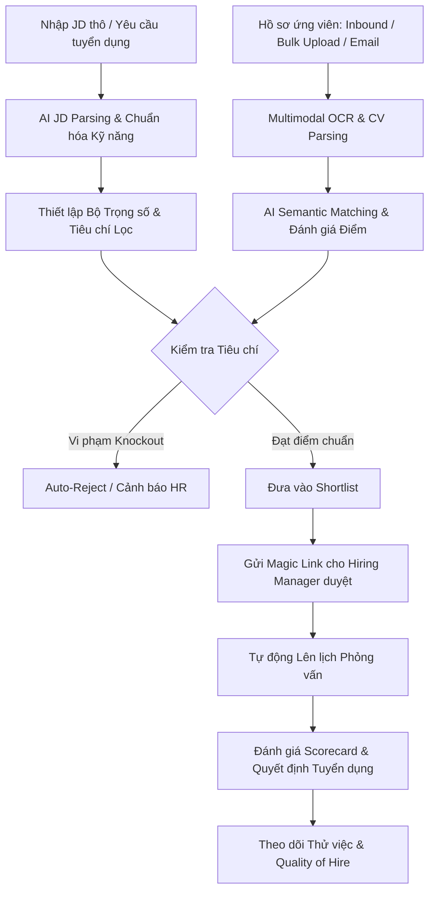

# 🚀 AI Recruitment &amp; Candidate Management Platform (resume-analyze)

> **Hệ thống Quản lý và Đánh giá Hồ sơ Tuyển dụng Tích hợp Trí tuệ Nhân tạo (AI-Powered In-house ATS)**  
> Giải pháp tự động hóa sàng lọc, xếp hạng ứng viên chuẩn xác dựa trên so khớp ngữ nghĩa (Semantic Matching) và tối ưu hóa tương tác 2 chiều giữa Doanh nghiệp và Ứng viên.

---

## 📌 Giới thiệu dự án

Trong quy trình tuyển dụng truyền thống của doanh nghiệp, bộ phận Nhân sự (HR) thường gặp phải các điểm nghẽn lớn:

- Quá tải hồ sơ (CV) với định dạng không đồng nhất (PDF scan, hình ảnh, DOCX, layout đa cột).
- Đánh giá hồ sơ dựa trên từ khóa đơn thuần (Keyword matching) dễ bỏ sót ứng viên tiềm năng hoặc chọn nhầm ứng viên "nhồi nhét từ khóa".
- Quy trình phản hồi giữa HR và Trưởng phòng chuyên môn (Hiring Manager) bị phân mảnh, tốn nhiều thời gian qua email/chat rời rạc.
- Trải nghiệm ứng viên chưa được tối ưu, thiếu tính minh bạch về tiến độ tuyển dụng.

`**resume-analyze**` ra đời nhằm giải quyết triệt để những thách thức trên, phục vụ mô hình **Tuyển dụng Nội bộ Doanh nghiệp (In-house HR)**. Hệ thống kết hợp giữa công nghệ trích xuất đa tầng (Multimodal OCR &amp; Parsing) và mô hình ngôn ngữ lớn (LLM/Semantic Embeddings) để xây dựng một nền tảng tuyển dụng thông minh, minh bạch và hiệu quả cao.

---

## 🌟 Tính năng nổi bật

### 1. 🤖 AI Bóc tách &amp; Chuẩn hóa Hồ sơ (Multimodal Parsing &amp; OCR)

- **Đa định dạng tiếp nhận:** Hỗ trợ PDF (digital &amp; scan), DOCX, DOC và tệp hình ảnh (PNG, JPG).
- **Trích xuất thông minh:** Phân tích chính xác bố cục phức tạp (Canva layout, CV 2 cột, bảng biểu) bằng OCR kết hợp Vision LLM.
- **Xử lý Song ngữ Anh - Việt:** Tự động chuẩn hóa thuật ngữ tiếng Việt có dấu/không dấu và tiếng Anh; hỗ trợ so khớp chéo (CV tiếng Việt với JD tiếng Anh và ngược lại).
- **Skill Ontology:** Tự động ánh xạ các kỹ năng tương đương (ví dụ: `ReactJS` $\leftrightarrow$ `React` $\leftrightarrow$ `Next.js`).

### 2. 🎯 Đánh giá &amp; Xếp hạng Ứng viên Thông minh (AI Scoring &amp; Ranking)

- **Semantic Matching:** Đánh giá độ phù hợp theo ngữ cảnh năng lực, không phụ thuộc vào từ khóa cứng nhắc.
- **Cấu hình Trọng số Linh hoạt (Dynamic Weights):** AI tự động đề xuất bộ trọng số phù hợp theo cấp bậc (Seniority) và tính chất vị trí (Kỹ năng, Kinh nghiệm, Dự án, Học vấn, Kỹ năng mềm).
- **Giải trình minh bạch (Explainable AI):** Không chỉ đưa ra số điểm, AI cung cấp bản phân tích chi tiết: Điểm mạnh, Khoảng cách năng lực (Skill Gaps) và Lý do đề xuất.
- **Xử lý Tiêu chí Loại trừ (Knockout Filters):** Tự động phân loại hồ sơ vi phạm tiêu chí bắt buộc (Auto-Reject với cơ chế hoãn thông báo nhân văn hoặc Flag &amp; Alert để HR thẩm định).

### 3. 👥 Cổng Tương tác Trưởng phòng Chuyên môn (Hiring Manager Portal)

- **Truy cập 1 chạm qua Magic Link:** Gửi danh sách ứng viên đạt chuẩn (Shortlist) cho Hiring Manager qua liên kết mã hóa an toàn, không cần nhớ tài khoản mật khẩu.
- **Phản hồi tức thì:** Cho phép duyệt phỏng vấn, từ chối kèm lý do hoặc yêu cầu bổ sung thông tin trực tiếp trên giao diện web tinh gọn, đồng bộ tức thời với HR.

### 4. 🧭 Cổng Ứng viên &amp; Trợ lý AI Hướng nghiệp (Candidate Portal &amp; Copilot)

- **Đăng ký không mật khẩu (Passwordless):** Đăng nhập nhanh qua Google/LinkedIn OAuth hoặc Magic Link/OTP qua Email/SMS.
- **AI CV Copilot:** Tự động điền thông tin hồ sơ (Auto-fill Profile), phân tích độ sẵn sàng (Pre-flight check) và gợi ý tối ưu mô tả kinh nghiệm theo mô hình STAR.
- **AI Job Recommendation:** Tự động gợi ý công việc phù hợp trong nội bộ doanh nghiệp dựa trên hồ sơ sẵn có.
- **Minh bạch tiến độ:** Cung cấp Live Timeline theo dõi trạng thái hồ sơ thời gian thực và nhận phản hồi đóng góp (Constructive Feedback) từ AI nếu chưa phù hợp.

### 5. 📅 Quản trị Tuyển dụng Toàn diện (ATS &amp; Pipeline Management)

- **Kanban Workflow:** Quy trình tuyển dụng kéo thả linh hoạt, tùy biến theo từng vị trí.
- **Lên lịch phỏng vấn tự động:** Tích hợp đồng bộ Google Meet, Zoom, Microsoft Teams và gửi nhắc hẹn tự động đa kênh (Email/SMS).
- **Đo lường Chất lượng Tuyển dụng (Quality of Hire):** Theo dõi mốc thử việc (30/60/90 ngày), ghi nhận KPI và tỷ lệ giữ chân nhân sự.

### 6. 🔒 Bảo mật &amp; Tuân thủ Dữ liệu

- Tuân thủ quy định bảo vệ dữ liệu cá nhân (Nghị định 13/2023/NĐ-CP &amp; chuẩn GDPR).
- Hỗ trợ quyền kiểm soát dữ liệu: Rút đơn ứng tuyển (Withdraw), chuyển trạng thái tìm việc, và Quyền được lãng quên (Right to be Forgotten).

---

## 🏛️ Cơ cấu Phân quyền (RBAC)

Hệ thống được thiết kế theo mô hình phân quyền chuẩn cho In-house HR:


| Vai trò                | Mô tả nhiệm vụ                                                                                                                      |
| ---------------------- | ----------------------------------------------------------------------------------------------------------------------------------- |
| **HR Manager / Admin** | Quản trị toàn hệ thống, cấu hình luật chấm điểm AI toàn cục, phê duyệt ngân sách/định biên, xem báo cáo KPI tuyển dụng cấp công ty. |
| **HR Recruiter**       | Tạo và quản lý vị trí tuyển dụng, nạp và sàng lọc CV bằng AI, gửi Shortlist cho phòng ban, điều phối lịch phỏng vấn và gửi Offer.   |
| **Hiring Manager**     | Xem xét ứng viên Shortlist thuộc bộ phận của mình qua Magic Link, đánh giá chuyên môn, quyết định mời phỏng vấn.                    |
| **Interviewer**        | Thành viên hội đồng phỏng vấn; nhận lịch và chấm điểm ứng viên theo bảng tiêu chí chuẩn hóa (Scorecard).                            |


---

## 🔄 Luồng Hoạt động Tổng quan (Workflow)



---

## 📂 Cấu trúc Thư mục

```text
resume-analyze/
├── .agents/                 # Cấu hình & kỹ năng mở rộng của AI Agent
├── docs/                    # Tài liệu đặc tả nghiệp vụ & phân tích chuyên sâu
│   └── business_requirements_interview.md  # 100 câu hỏi & quyết định nghiệp vụ chuẩn
├── skills-lock.json         # Danh mục dependency của agent skills
├── .gitignore               # Cấu hình loại trừ file nhạy cảm và cache
└── README.md                # Tài liệu giới thiệu dự án
```


&nbsp;